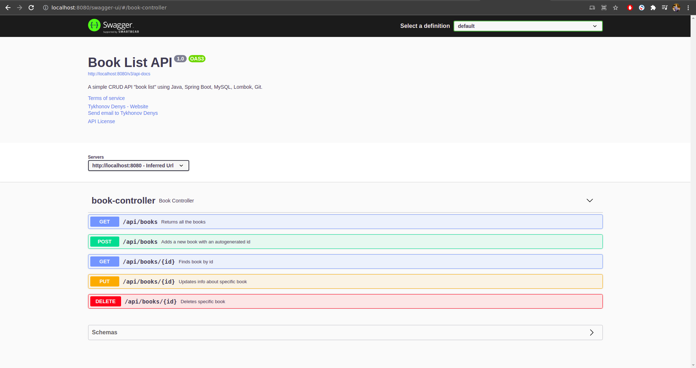

# Book-list
A simple CRUD app "Book List". Used technologies: Java, Spring Boot, MySQL, Lombok, Git, Swagger.
# Explore Rest APIs
The app defines following endpoints.

| Method | URL | Description |
| ------ | --- | ----------- |
| **GET** | swagger-ui/#/ | Swagger UI |
| **POST** | /api/books | Adds a new book with an autogenerated id |
| **GET** | /api/books | Returns all the books |
| **GET** | /api/books/{id} | Finds book by id |
| **PUT** | /api/books/{id} | Updates info about specific book |
| **DELETE** | /api/books/{id} | Deletes specific book |

# Screenshot
